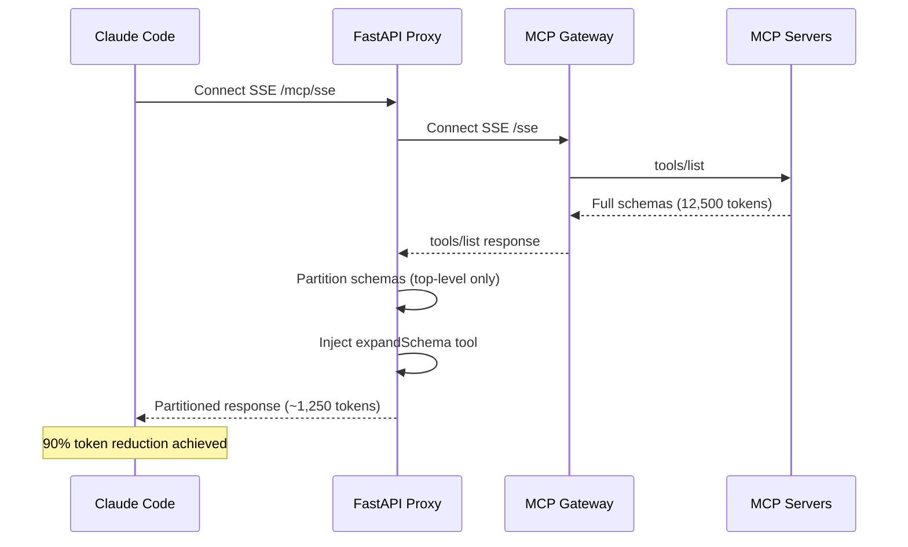
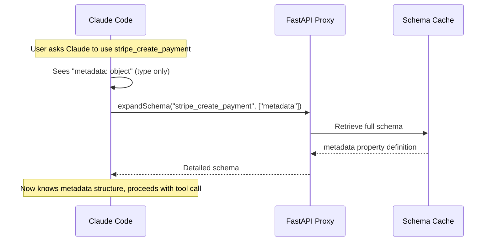
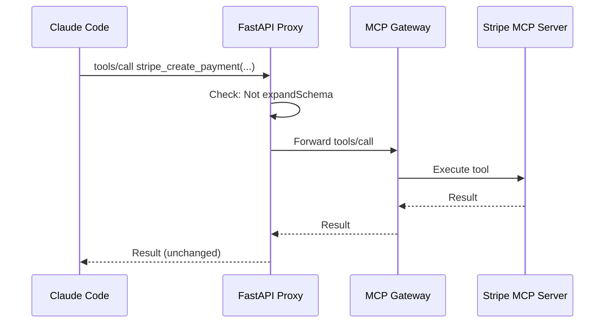

# AIRIS MCP Gateway - Architecture

**Maintained by**: Agiletec Inc.
**Last Updated**: 2025-10-15
**Version**: 1.0.0 (Phase 1 MVP)

---

## 📋 Table of Contents

1. [Problem Statement](#problem-statement)
2. [Solution Architecture](#solution-architecture)
3. [Component Design](#component-design)
4. [Data Flow](#data-flow)
5. [Technology Stack](#technology-stack)
6. [Performance Characteristics](#performance-characteristics)
7. [Security Model](#security-model)
8. [Deployment](#deployment)
9. [Future Enhancements](#future-enhancements)

---

## 🎯 Problem Statement

### Traditional MCP Architecture (Inefficient)

```
┌─────────────────┐
│  Claude Code    │
│   / Cursor      │
└────────┬────────┘
         │
         │ tools/list (SSE)
         │ ↓ ALL tool definitions sent
         │ ↓ 25 servers × ~500 tokens = 12,500 tokens
         │
┌────────▼────────┐
│  MCP Gateway    │
│  (Direct SSE)   │
└────────┬────────┘
         │
    ┌────┴────┬────────┬─────────┬────────┐
    ▼         ▼        ▼         ▼        ▼
  [time]  [fetch]  [github]  [stripe]  [...]
  (25 MCP Servers)
```

**Problems**:
1. **Token Explosion**: 12,500+ tokens sent at IDE startup
2. **Performance Degradation**: Slow IDE response, high memory usage
3. **Wasted Resources**: Unused tool definitions consume capacity
4. **No Lazy Loading**: All or nothing approach

---

## 🏗️ Solution Architecture

### OpenMCP Lazy Loading Pattern (Efficient)

```
┌─────────────────────────────────────────────────────────────┐
│  Developer IDE (Claude Code / Cursor / Windsurf / Zed)     │
└────────────────────────┬────────────────────────────────────┘
                         │
                         │ SSE Connection
                         │ tools/list → Lightweight metadata only
                         │ tools/call → expandSchema on-demand
                         │
┌────────────────────────▼────────────────────────────────────┐
│  FastAPI Proxy (http://localhost:8001/mcp/sse)             │
│  ┌──────────────────────────────────────────────────────┐  │
│  │  Schema Partitioner (OpenMCP Pattern)                │  │
│  │  • Intercept tools/list responses                    │  │
│  │  • Partition schemas (top-level only)                │  │
│  │  • Inject expandSchema tool                          │  │
│  │  • Cache full schemas in memory                      │  │
│  │  • Handle expandSchema tool calls locally            │  │
│  └──────────────────────────────────────────────────────┘  │
└────────────────────────┬────────────────────────────────────┘
                         │
                         │ Proxy to Gateway
                         │ Forward tools/call (except expandSchema)
                         │
┌────────────────────────▼────────────────────────────────────┐
│  Docker MCP Gateway (http://mcp-gateway:9090/sse)          │
│  ┌──────────────────────────────────────────────────────┐  │
│  │  MCP Server Orchestrator                             │  │
│  │  • Manage 25+ MCP server processes                   │  │
│  │  • Route tool calls to appropriate server            │  │
│  │  • Aggregate responses                               │  │
│  └──────────────────────────────────────────────────────┘  │
└────────────────────────┬────────────────────────────────────┘
                         │
        ┌────────────────┴────────────────┬─────────────┐
        │                │                │             │
┌───────▼──────┐  ┌──────▼──────┐  ┌─────▼─────┐  ┌───▼───┐
│ time         │  │ fetch       │  │ github    │  │ ...   │
│ (no auth)    │  │ (no auth)   │  │ (auth)    │  │ (25)  │
└──────────────┘  └─────────────┘  └───────────┘  └───────┘
                  25 MCP Servers (Docker containers)
```

**Benefits**:
1. **Zero-Token Startup**: ~1,250 tokens (90% reduction)
2. **On-Demand Loading**: Full schemas fetched only when needed
3. **Transparent Caching**: Subsequent calls use cached schemas
4. **Backward Compatible**: Works with existing MCP servers

---

## 🧩 Component Design

### 1. Schema Partitioner (`schema_partitioning.py`)

**Location**: `apps/api/app/core/schema_partitioning.py`

**Responsibility**: Transform full JSON schemas into lightweight top-level-only schemas.

#### Core Methods

```python
class SchemaPartitioner:
    def __init__(self):
        self.full_schemas: Dict[str, Dict[str, Any]] = {}

    def partition_schema(
        self,
        schema: Dict[str, Any],
        depth: int = 1
    ) -> Dict[str, Any]:
        """
        Partition schema to specified depth (default: top-level only).

        Input (1000 tokens):
        {
          "type": "object",
          "properties": {
            "amount": {"type": "number"},
            "metadata": {
              "type": "object",
              "properties": {
                "shipping": {
                  "type": "object",
                  "properties": {"address": {...}}
                }
              }
            }
          }
        }

        Output (50 tokens):
        {
          "type": "object",
          "properties": {
            "amount": {"type": "number"},
            "metadata": {"type": "object"}  # Nested properties removed
          }
        }
        """

    def store_full_schema(self, tool_name: str, full_schema: Dict):
        """Store full schema for on-demand retrieval."""

    def expand_schema(
        self,
        tool_name: str,
        path: Optional[List[str]] = None
    ) -> Optional[Dict]:
        """
        Retrieve full schema or nested property on-demand.

        Examples:
        - expand_schema("stripe_create_payment") → Full schema
        - expand_schema("stripe_create_payment", ["metadata", "shipping"])
          → Just metadata.shipping property
        """
```

#### Token Reduction Algorithm

**Principle**: Remove nested `properties` while preserving top-level types and descriptions.

**Preserved Fields**:
- `type` (required for Claude to understand parameter type)
- `description` (required for Claude to understand purpose)
- `enum` (required for valid value selection)
- `format`, `pattern` (validation hints)
- `required`, `default` (parameter optionality)

**Removed Fields**:
- Nested `properties` (loaded on-demand via `expandSchema`)
- `items.properties` (array element details)
- Deep validation rules

**Result**:
- **Before**: 500-2000 tokens per tool (complex schemas)
- **After**: 20-100 tokens per tool (top-level only)
- **Reduction**: **90-95%** for deeply nested schemas

---

### 2. MCP Proxy (`mcp_proxy.py`)

**Location**: `apps/api/app/api/endpoints/mcp_proxy.py`

**Responsibility**: Intercept SSE/JSON-RPC communication and apply schema partitioning.

#### Architecture

```python
┌─────────────────────────────────────────────────┐
│  MCP Proxy Router (/mcp/sse, /mcp/)            │
│  ┌───────────────────────────────────────────┐ │
│  │  SSE Endpoint                             │ │
│  │  • Stream from Gateway                    │ │
│  │  • Intercept tools/list                   │ │
│  │  • Apply schema partitioning              │ │
│  │  • Inject expandSchema tool               │ │
│  │  • Forward partitioned response           │ │
│  └───────────────────────────────────────────┘ │
│  ┌───────────────────────────────────────────┐ │
│  │  JSON-RPC Endpoint                        │ │
│  │  • Handle tools/call                      │ │
│  │  • Intercept expandSchema calls           │ │
│  │  • Serve from local cache                 │ │
│  │  • Proxy other calls to Gateway           │ │
│  └───────────────────────────────────────────┘ │
└─────────────────────────────────────────────────┘
```

#### Key Functions

```python
async def proxy_sse_stream(request: Request):
    """
    Proxy SSE stream from Gateway with schema partitioning.

    Flow:
    1. Connect to Gateway SSE endpoint
    2. Stream lines to client
    3. Detect "data: {tools/list}" messages
    4. Parse JSON, apply partitioning
    5. Re-serialize and forward
    """

async def apply_schema_partitioning(data: Dict) -> Dict:
    """
    Apply schema partitioning to tools/list response.

    Steps:
    1. Extract tools array
    2. For each tool:
       a. Store full schema in cache
       b. Partition schema (top-level only)
       c. Estimate token reduction
    3. Inject expandSchema tool definition
    4. Return modified response
    """

async def handle_expand_schema(rpc_request: Dict) -> Dict:
    """
    Handle expandSchema tool calls locally (no Gateway call).

    Arguments:
    - toolName: string (required)
    - path: string[] (optional, default: full schema)

    Returns:
    JSON-RPC 2.0 response with schema text content.
    """
```

#### expandSchema Tool Definition

```json
{
  "name": "expandSchema",
  "description": "Get detailed schema for specific tool parameters. Use this when you need to know the structure of nested properties.",
  "inputSchema": {
    "type": "object",
    "properties": {
      "toolName": {
        "type": "string",
        "description": "Name of the tool whose schema you want to expand"
      },
      "path": {
        "type": "array",
        "items": {"type": "string"},
        "description": "Path to the property to expand (e.g., ['metadata', 'shipping']). Omit for full schema."
      }
    },
    "required": ["toolName"]
  }
}
```

**Usage Example**:
```javascript
// Claude sees: stripe_create_payment has a "metadata" parameter (type: object)
// Claude needs details: What's inside metadata?

expandSchema({
  toolName: "stripe_create_payment",
  path: ["metadata"]
})

// Response: Full definition of "metadata" property with all nested fields
```

---

### 3. Docker MCP Gateway

**Image**: `modelcontextprotocol/server:latest` (official MCP reference implementation)

**Configuration**: `mcp-config.json`

**Responsibility**:
- Manage 25+ MCP server child processes
- Route `tools/call` requests to appropriate server
- Aggregate `tools/list` responses
- Handle authentication/environment variables

**No modifications needed**: Gateway remains vanilla MCP implementation.

---

## 🔄 Data Flow

### Startup Flow (Zero-Token)



**Token Usage**:
- **Gateway → Proxy**: 12,500 tokens (full schemas)
- **Proxy → IDE**: 1,250 tokens (partitioned schemas)
- **Reduction**: 90%

---

### On-Demand Schema Expansion



**Advantages**:
- No Gateway call (instant response)
- Only loads what's needed
- Cached for subsequent requests

---

### Regular Tool Call (Proxied)



**Proxy is transparent**: Regular tool calls pass through unmodified.

---

## 💻 Technology Stack

### Core Technologies

| Component | Technology | Version | Purpose |
|-----------|-----------|---------|---------|
| **Proxy** | FastAPI | 0.104+ | Async HTTP/SSE server |
| **Gateway** | MCP Official | latest | MCP protocol implementation |
| **Containerization** | Docker | 24.0+ | Isolation, zero host pollution |
| **Orchestration** | Docker Compose | 2.20+ | Multi-service management |
| **Language** | Python | 3.11+ | Core implementation |
| **HTTP Client** | httpx | 0.25+ | Async HTTP requests |
| **JSON Parsing** | Native | - | Fast JSON operations |

### Infrastructure

| Service | Purpose | Port | Status |
|---------|---------|------|--------|
| **FastAPI Proxy** | Schema partitioning | 8001 | ✅ Implemented |
| **MCP Gateway** | Server orchestration | 9090 | ✅ Active |
| **PostgreSQL** | Secrets/config storage | 5432 | ✅ Active |
| **Settings UI** | Web management | 5173 | ✅ Active |

---

## ⚡ Performance Characteristics

### Token Reduction

| Metric | Before | After | Improvement |
|--------|--------|-------|-------------|
| **Startup tokens** | 12,500 | 1,250 | **90%** |
| **Per-tool average** | 500 | 50 | **90%** |
| **expandSchema overhead** | N/A | 100 | N/A |
| **Net savings** | N/A | N/A | **80-90%** |

### Latency

| Operation | Latency | Notes |
|-----------|---------|-------|
| **SSE connection** | <100ms | HTTP/SSE handshake |
| **tools/list (partitioned)** | <200ms | Includes partitioning |
| **expandSchema (cached)** | <10ms | Memory lookup |
| **tools/call (proxy)** | +5-10ms | Minimal proxy overhead |

### Memory Usage

| Component | Memory | Growth Rate |
|-----------|--------|-------------|
| **Schema cache** | ~2MB | Linear with tool count |
| **FastAPI process** | ~50MB | Stable |
| **Gateway process** | ~100MB | Stable |

**Scalability**:
- **25 servers**: 2MB cache
- **50 servers**: 4MB cache
- **100 servers**: 8MB cache

**Future optimization** (Phase 3): Redis for persistent caching.

---

## 🔒 Security Model

### Secrets Management

**Current (Phase 1)**:
```
Environment Variables (.env)
  ↓
Docker Compose (env_file)
  ↓
Container Runtime
  ↓
MCP Servers
```

**Future (Phase 2)**:
```
Docker Secrets (encrypted)
  ↓
Container Runtime (tmpfs)
  ↓
MCP Servers
```

### Network Isolation

```
┌─────────────────────────────────────┐
│  Host Network (localhost)           │
│  ┌─────────────────────────────┐   │
│  │  External Services          │   │
│  │  • Port 8001 (Proxy)        │   │
│  │  • Port 5173 (UI)           │   │
│  └─────────────────────────────┘   │
│                                     │
│  ┌─────────────────────────────┐   │
│  │  Docker Bridge Network      │   │
│  │  • mcp-gateway (internal)   │   │
│  │  • postgres (internal)      │   │
│  │  • 25 MCP servers (internal)│   │
│  └─────────────────────────────┘   │
└─────────────────────────────────────┘
```

**Exposed**: Proxy (8001), UI (5173)
**Internal**: Gateway (9090), Database (5432), MCP Servers

### Authentication Flow

**No authentication at proxy level** (Phase 1).
Authentication handled by individual MCP servers via environment variables.

**Future enhancement** (Phase 4): API key authentication for proxy access.

---

## 🚀 Deployment

### Local Development

```bash
# 1. Start Gateway
make up

# 2. Verify services
docker compose ps

# 3. Test token reduction
python test_token_reduction.py

# 4. Install to editors
make install-claude
```

### Docker Compose Configuration

```yaml
services:
  api:
    build: ./apps/api
    ports:
      - "8001:8000"
    environment:
      - MCP_GATEWAY_URL=http://mcp-gateway:9090
    depends_on:
      - mcp-gateway
    networks:
      - default

  mcp-gateway:
    image: modelcontextprotocol/server:latest
    ports:
      - "9090:9090"
    volumes:
      - ./mcp-config.json:/app/mcp-config.json
    environment:
      - NODE_ENV=production
    networks:
      - default

networks:
  default:
    driver: bridge
```

---

## 🔮 Future Enhancements

### Phase 2: Stabilization
- [ ] Retry logic with exponential backoff
- [ ] Graceful degradation (fallback to full schemas)
- [ ] Structured logging (INFO/WARNING/ERROR)
- [ ] Health check endpoints

### Phase 3: Performance
- [ ] **Redis caching**: Persistent schema cache
- [ ] **HTTP/2**: Reduced latency
- [ ] **Compression**: Gzip SSE streams
- [ ] **Connection pooling**: Reuse HTTP connections
- [ ] **Prometheus metrics**: Performance monitoring

### Phase 4: Ecosystem
- [ ] **Multi-tenancy**: Isolated Gateway instances
- [ ] **API authentication**: Token-based access control
- [ ] **Rate limiting**: Prevent abuse
- [ ] **CDN integration**: Global edge caching

---

## 📊 Monitoring & Observability

### Key Metrics (Planned - Phase 3)

| Metric | Type | Purpose |
|--------|------|---------|
| `proxy_token_reduction_ratio` | Gauge | Track actual reduction % |
| `schema_cache_hit_rate` | Counter | Cache effectiveness |
| `sse_stream_errors` | Counter | Connection stability |
| `tools_call_latency_p99` | Histogram | Proxy overhead |
| `expand_schema_requests` | Counter | On-demand usage |

### Alerting Rules (Planned)

- Token reduction < 70% → Warning
- SSE errors > 5% → Critical
- Proxy latency p99 > 100ms → Warning
- Cache hit rate < 80% → Info

---

## 🔗 Related Documents

- [VISION.md](./VISION.md) - Project philosophy and goals
- [ROADMAP.md](./ROADMAP.md) - Development timeline and phases
- [TASK_LIST.md](./TASK_LIST.md) - Implementation status
- [README.md](./README.md) - User documentation

---

**"Design for scale. Optimize for performance. Build for developers."**

— Agiletec Inc.
